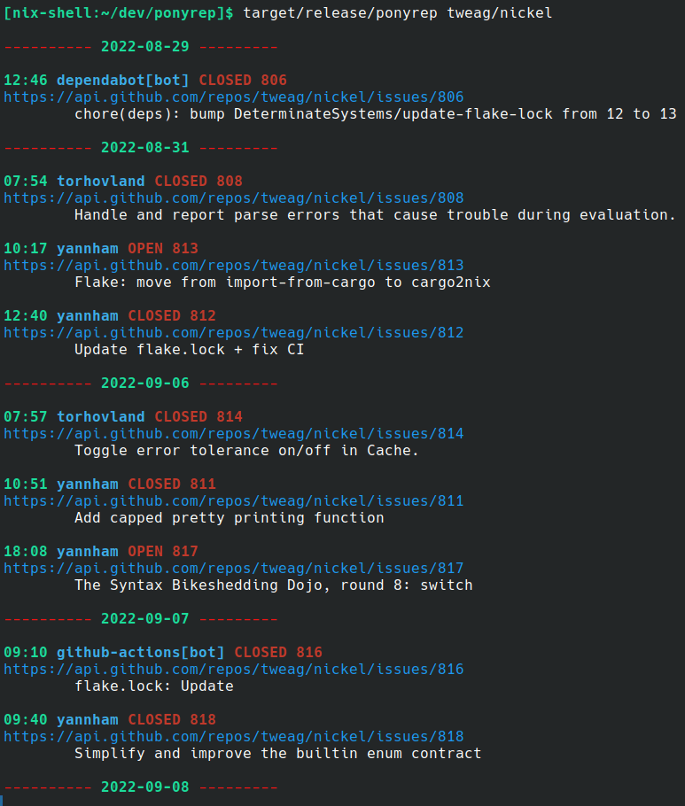

# Ponyrep

Generate a daily log of a GitHub repository activity



# Building

You need the dependencies `cargo`, `rustc` and `clang` to compile `ponyrep`.

1. `git clone https://github.com/tweag/ponyrep`
2. `cd ponyrep`
3. `cargo build --release`

# Usage

```
Usage: ponyrep [OPTIONS] <organization/project>

Arguments:
  <organization/project>

Options:
  -j, --json
  -w, --wrap <wrapping width>
  -l, --lines <limit text lines per entry>
  -h, --help                                Print help information
```

You need the [GitHub CLI tool](https://cli.github.com/) `gh` in your `$PATH` and configured.  It's used to make API calls without having to deal with tokens.

# Todo

A list of ideas to add to ponyrep

- a way to give a custom formatting string
- handle PRs
- handle commits?
- break the limit of 100 last entries, which is very small for projects like nixos/nixpkgs
